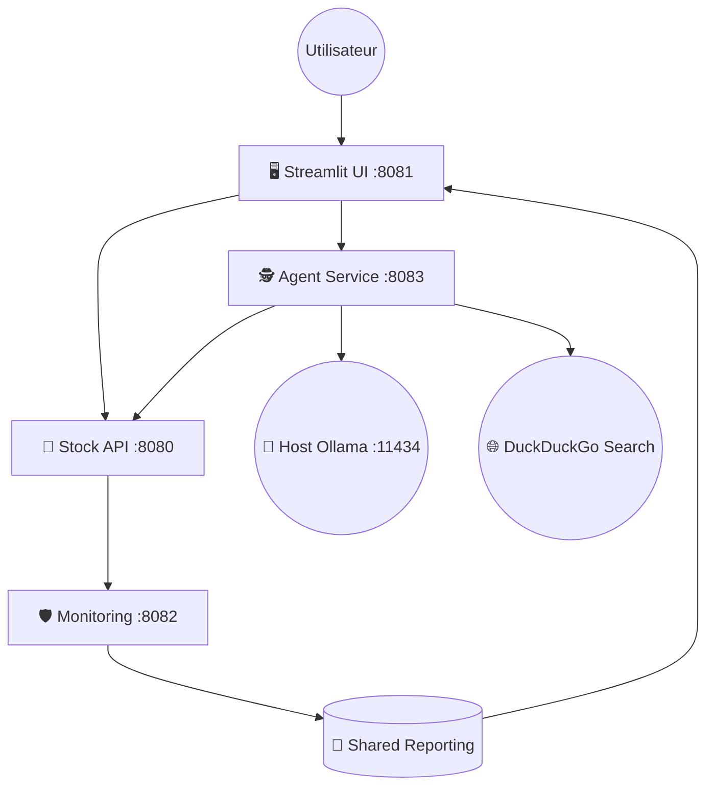

# 📈 Agent de Trading & MLOps (Local LLM)

Une plateforme d'analyse financière "Privacy-First" combinant l'apprentissage automatique traditionnel (LSTM) et l'IA Générative (Agents LangChain). Entièrement dockerisée et localisée en Français.


## 🚀 Fonctionnalités

*   **🤖 Agent IA Autonome** : Utilise **Llama 3.2** (via Ollama local) pour analyser les tendances techniques et les actualités.
*   **📊 MLOps & Monitoring** : Détection de "Drift" en temps réel avec **Evidently AI**.
*   **🔄 Cycle de Vie ML** : Pipeline de réentraînement automatique déclenché par le feedback utilisateur ("Battle Mode").
*   **⚡ Architecture Microservices** :
    *   `stock-api` : Modèle LSTM et gestion des prédictions (FastAPI).
    *   `stock-ui` : Dashboard interactif (Streamlit).
    *   `agent-service` : Cerveau de l'agent (LangChain).
    *   `monitoring-service` : Surveillance de la qualité des données.
*   **🇫🇷 100% Français** : Interface et réponses de l'IA entièrement localisées.

## 🛠️ Architecture Technique

Le projet repose sur une communication inter-conteneurs orchestrée par Docker Compose :



## 📋 Prérequis

*   **Docker** & **Docker Compose**
*   **Ollama** (installé sur la machine hôte)

## ⚡ Installation & Démarrage

### 1. Configurer Ollama (Hôte)

Assurez-vous qu'Ollama tourne sur votre machine et téléchargez le modèle requis :

```bash
ollama pull llama3.2
ollama serve
```

### 2. Démarrer l'Application

Clonez ce dépôt et lancez les conteneurs :

```bash
git clone https://github.com/votre-user/trading-agent.git
cd trading-agent

# Build & Start
docker-compose up --build
```

### 3. Accéder à l'Interface

Ouvrez votre navigateur sur : **[http://localhost:8081](http://localhost:8081)**

## 🎮 Utilisation

1.  **Entrez un Ticker** (ex: `NVDA`, `AAPL`) dans la barre de recherche.
2.  Cliquez sur **"Lancer l'Analyse"**.
3.  **Consultez** :
    *   Le graphique technique interactif via Plotly.
    *   L'analyse textuelle générée par l'IA (section "Raisonnement de l'IA").
    *   Les métriques de santé du système dans la barre latérale ("Gardien du Modèle").
4.  **Participez** : Utilisez les boutons "Je Valide" ou "Je Conteste" pour aider le modèle à s'améliorer (Reinforcement Learning from Human Feedback - RLHF).

## 🛡️ Monitoring (Drift Detection)

Le système surveille en permanence la stabilité des données. Si les données du marché dévient trop de l'entraînement initial (Drift), une alerte **"⚠️ Drift Detected"** apparaîtra dans l'interface, avertissant que les prédictions peuvent être moins fiables.

## 🤝 Contribution

Les contributions sont les bienvenues ! N'hésitez pas à ouvrir une "Issue" ou une "Pull Request".
